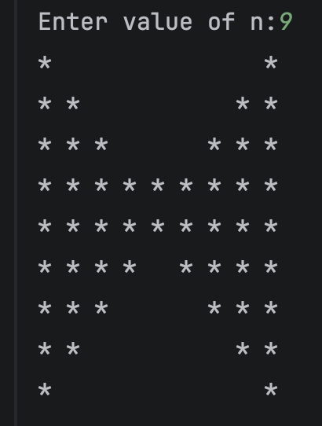
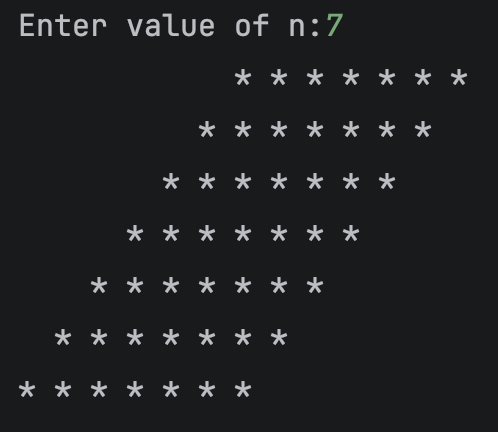
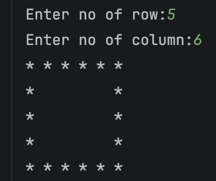
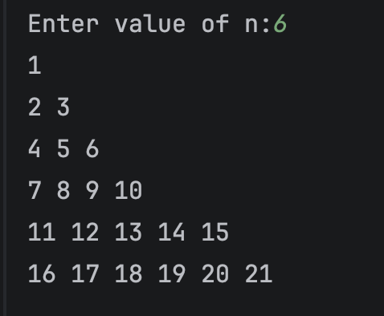

# Java Pattern Programs

A collection of Java pattern printing programs created while learning nested loops and conditional statements.

##  Concepts Used

- Nested Loops
- if-else Statements
- Row & Column Logic
- Pattern Printing

## ✅ Patterns Completed

- Butterfly Pattern
- Solid Rhombus
- Hollow Rectangle
- Floyd Triangle

## Butterfly Pattern Output

  

## Solid Rhombus Pattern Output

  

## Hollow Rectangle Pattern Output

  

## Floyd Triangle Pattern Output

  

